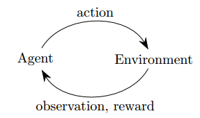
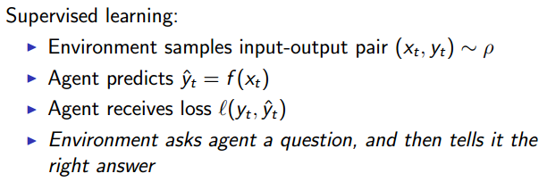
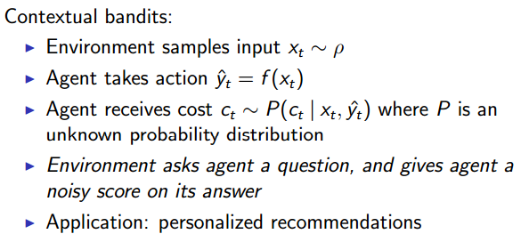
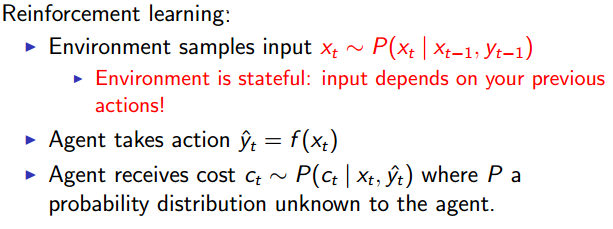

# 深度强化学习简介
| 课程名称 | CS 294: Deep Reinforcement Learning, Spring 2017 | 
| ------- | ---------------------------------- |
| 授课单位 | Stanford University |
| 授课者   | Sergey Levine, John Schulman, Chelsea Finn |  
| 课程资料 | http://rll.berkeley.edu/deeprlcourse/ |
| 章节名称 | Introduction to Deep Reinforcement Learning |
| 参考资料 | http://rll.berkeley.edu/deeprlcourse/docs/lec0.pdf |

## 什么是强化学习
在当下大量的机器学习问题涉及到做出一系列行为的背景之下，强化学习就是一种解决此类问题的手段。
强化学习场景通常是媒介(agent)与环境(environment)之间的交互，媒介对于环境做出行为(action), 然后环境对这种行为进行回馈，强化学习就是使这种回报最大化。

强化学习是一种部分可观察马尔科夫决策处理(POMDP-- partially observable Markov decision process)。其部分性体现在不知道要进行最优化以获得回报最大化的函数是什么，因此无法直接进行参数训练，但是却可以根据reward进行决策的调整来实现回报最大化。

## 强化学习实例阐释
### 发动机控制和机器人
**观察(Observations)**: 相机图片，关节角度  
**行为(action)**： 关节扭矩运动  
**回报(rewards)**: 保持平衡，导航目标位置，为人类服务，保护人类  
### 商务投资
**观察**: 当前库存水平(inventory levels)  
**行为**: 每个项目单元买进的数量  
**回报**: 利润  
### Hard Attention 分类
**观察**: 当前图片窗格  
**行为**: 调整看的位置  
**回报**: 正确分类之后正确分类数量加一  
### 机器翻译中的顺序或者结构预测
**观察**: 待翻译语言中的单词  
**行为**: 产生目标语言的单词  
**回报**: 准确度(BLEU score)  

## 什么是深度强化学习
强化学习突出点在于有一个环境反馈机制，而深度学习的核心便是神经网络的使用，因此，深度强化学习的意义便是使用神经网络去优化目标函数的强化学习。
### 特征
1. 策略: 选择下一个动作
2. 值函数: 衡量状态的goodness 或者是state-action 对
3. 动态模型： 预测接下来的状态并接收回报

## 强化学习和其他机器学习问题的联系

## 强化学习和监督学习的差异
强化学习具有以下特点：

1. 你无法完全地得知学习过程中需要优化的函数，你只能通过与它交互来进行优化；
2. 交互式需要考虑之前情况，输入的xt依赖于你之前的动作。

## 近期深度强化学习的成功范例
ATARI和AlphaGo都是其成功的范例，详情参见http://rll.berkeley.edu/deeprlcourse/docs/lec0.pdf 
