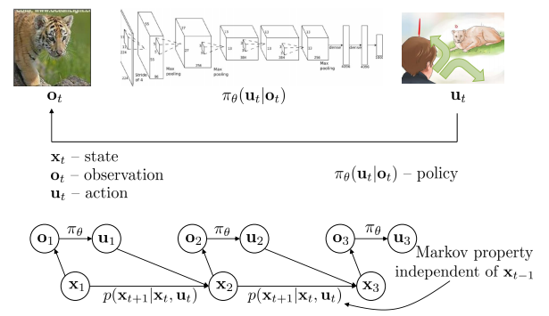
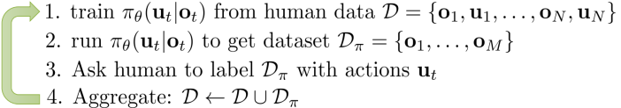
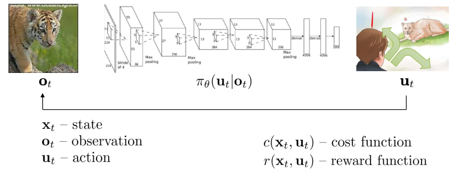

# Supervised Learning of Behaviors:  
## Deep Learning, Dynamical Systems, and Behavior Cloning

In my opinion, the key point of this course is **Imitation Learning**.

| Course Name | CS 294: Deep Reinforcement Learning, Spring 2017 | 
| ------- | ---------------------------------- |
| Teaching Apt | Stanford University |
| Instructor   | Sergey Levine      |  
| Course Material | http://rll.berkeley.edu/deeprlcourse/ |
| Chapter Name | Supervised Learning of Behaviors: Deep Learning, Dynamical Systems, and Behavior Cloning |
| Reference Material | http://rll.berkeley.edu/deeprlcourse/docs/week_2_lecture_1_behavior_cloning.pdf|

# Terminology and Notation

# Imitation Learning
One Important Method for Imitation Learning: **DAgger**.

## DAgger:Dataset Aggregation
- goal: collect training data from the distribution of our policy data instead of from the distribution of training data as the mistakes will sum up due to the fact that we may make some mistakes after taking every policy.
- Algorithm of DAgger:

   

The difficulty in this algorithm is to ask human to label dataset with actions and it is widly used in supervised learning.

**Improvement:**  Label the dataset or set a standard to meassure the policy instead. So we will talk about cost function and reward function of imitation learning.

# The problem of Imitation Learning
- Human needs to provide plentiful data in order to make dl works well, however, data is alway finite.
- Human is not good at providing some kinds of actions which can influent the result.
- Human can learn automatically while machines can not. Maybe we need transfer learning or something else.

## Learnig without human

## The trouble with reward and cost function
As is often the case, the cost function and reward function is hard to define.

Although there are some confusion about imitation learning, I will revise and update my notes later.

